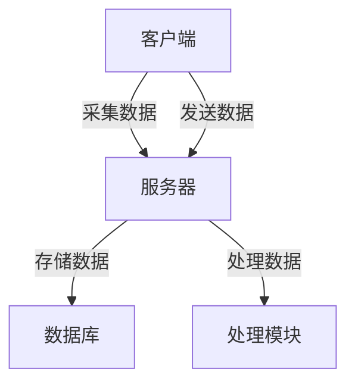

# 设备运行状态监控系统

## 项目概述

本项目旨在实现一个设备运行状态监控系统，采用客户端-服务器架构。客户端使用Python实现，负责收集设备的CPU使用率、内存占用率、网络上下行流量以及进程的前10名。服务器端使用Java和Spring Boot实现，负责接收数据并通过HTML界面展示这些信息。

## 项目结构

# 项目架构图



此架构图展示了客户端和服务器之间的数据流关系。客户端负责采集数据并发送到服务器，服务器负责存储和处理数据。

- **客户端**: 使用Python实现，负责数据采集。
- **服务器端**: 使用Java和Spring Boot实现，负责数据接收和展示。
- **数据库**:使用sqlite3存储数据。位置在server/data/monitor.db
## 功能

1. **数据采集**: 多节点客户端采集设备的CPU使用率、内存占用率、网络上下行流量以及进程的前10名。
2. **数据传输**: 客户端将采集的数据发送到服务器端。
3. **数据展示**: 服务器端通过HTML界面展示接收到的数据,可点击节点查看不同服务器监控数据。

## 使用技术

- **客户端**: Python3
- **服务器端**: Java, Spring Boot, HTML

## 运行
1. 启动客户端进行数据采集并发送数据到服务器端。
```bash
pip install -r requirements.txt
python3 main.py
```
2. 启动服务器端。
```bash
mvn spring-boot:run
```
3. 启动前端在浏览器中查看服务器端展示的数据。
```bash
npm install
npm run dev
```